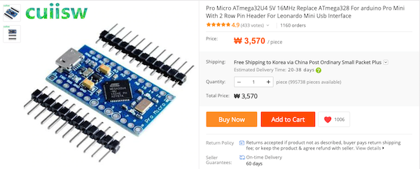
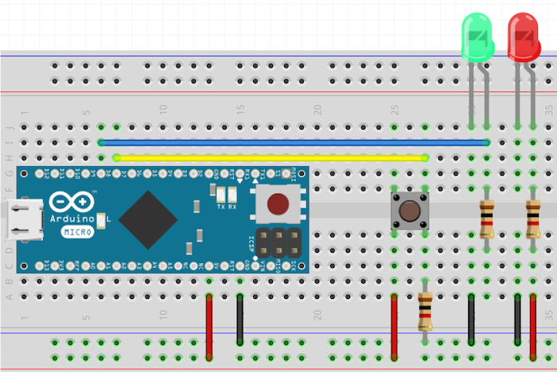
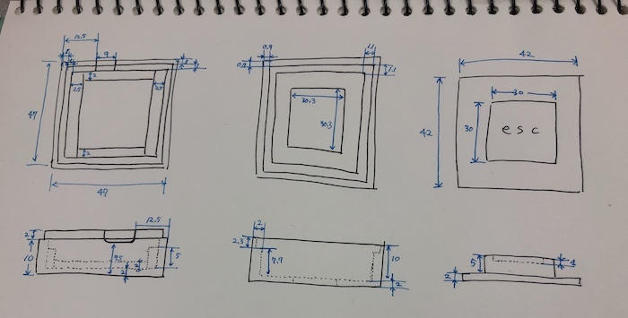
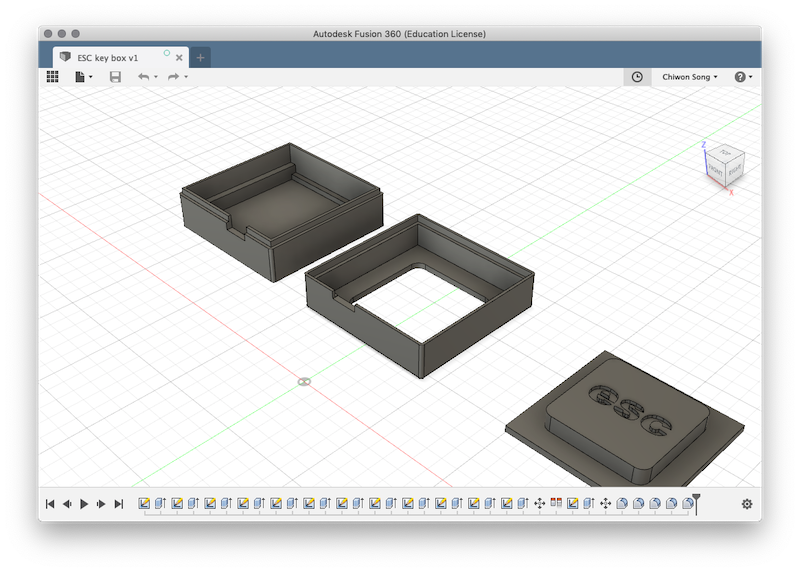
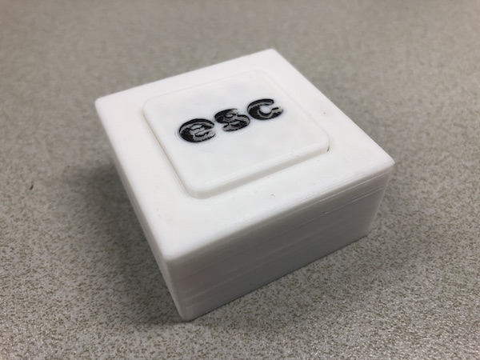

# vi 에디터 사용자를 위한 ESC 감성 프로젝트

`ESC`, 누르긴 눌러야 겠는데 눌리는 **맛**이 없으니..<br/>
맥북 터치바때문에 얼마나 고생이 많으셨습니까?<br/>
손만 얹었을 뿐인데 자동으로 눌려지는 어이없는 경험들.. 다들 있으시죠?<br/>
결국 참다못해 하나 만들고 말았습니다.

<br/>

### TL;DR

[비디오 보기](https://www.youtube.com/watch?v=JU4w-j4xfiQ&list=PL03rJBlpwTaC3Z4WcxxLu4CWCK_pf7VYb&index=1)

<br/>

### Virtual Keyboard

[Arduino](https://www.arduino.cc/)로 만들려고 생각해 보니, USB를 인식하고 [키보드 라이브러리](https://www.arduino.cc/reference/en/language/functions/usb/keyboard/)를 사용하려면 [레오나르도](https://www.arduino.cc/en/Main/Arduino_BoardLeonardo) 버전을 사용해야 합니다. 가격도 문제지만, 덩치가 너무 큽니다. [알리](https://www.aliexpress.com/)가 결국 이걸 해내내요!

Leonardo Interface 호환 MicroUSB Arduino ([링크](https://www.aliexpress.com/item/Pro-Micro-ATmega32U4-5V-16MHz-Replace-ATmega328-For-Arduino-Pro-Mini-With-2-Row-Pin-Header/32808519179.html?spm=a2g0s.9042311.0.0.46554c4dgy0c1F))<br/>

<br/>

이걸로 키보드 라이브러리를 사용해서 ESC가 동작하는지 부터 확인해 봅니다. <br/>
버튼을 달고, 버튼이 눌리는 것을 확인하기 위해서 LED도 달고.. 버튼이 눌리면 ESC 이벤트를 보냅니다.<br/>

```c++
#include <Keyboard.h>

int button = 7;
int led = 8;

int buttonState = 0;  

void setup() {
  pinMode(button, INPUT);
  pinMode(led, OUTPUT);
  Keyboard.begin();
}

void loop() {
  int state = digitalRead(button);

  if(state != buttonState) {
    if(buttonState == LOW && state == HIGH) {
      digitalWrite(led, HIGH); 
      Keyboard.press(KEY_ESC);
    } else if(buttonState == HIGH && state == LOW) {
      digitalWrite(led, LOW); 
      Keyboard.releaseAll();
    }
  }
  buttonState = state;
}
```

나중에 BUTTON과 LED 핀 위치는 적당히 바꾸는 걸로 하고 일단은 7, 8번으로..


([fritzing](http://fritzing.org)을 이용해서 그렸었는데, 만들 때 저장했던 파일 날라가서 이 글 쓰느라 새로 그림..)

[관련영상 보기 - 1](https://www.youtube.com/watch?v=JU4w-j4xfiQ&list=PL03rJBlpwTaC3Z4WcxxLu4CWCK_pf7VYb&index=1)<br/>
[관련영상 보기 - 2](https://www.youtube.com/watch?v=GzGF1r8Tx-I&list=PL03rJBlpwTaC3Z4WcxxLu4CWCK_pf7VYb&index=2)

<br/>

### Housing

만능기판에 납땜해서 만든 보드의 사이즈를 재고 거기에 맞는 껍데기를 만들기를 만들어 주었습니다.

우선 설계부터<br/>


이걸 [Fusion360](https://www.autodesk.com/products/fusion-360/overview)에서 모델링 합니다.<br/>
<br/>
[bottom.stl](modeling/bottom.stl) | [top.stl](modeling/top.stl) | 
[key.stl](modeling/key.stl)

그리고 3D 프린터로 출력해서 조립하면..<br/>



[관련영상 보기 - 3](https://www.youtube.com/watch?v=d6zu59emo6A&index=3&list=PL03rJBlpwTaC3Z4WcxxLu4CWCK_pf7VYb)<br/>
[관련영상 보기 - 4](https://www.youtube.com/watch?v=mdoqS-6Dr8s&list=PL03rJBlpwTaC3Z4WcxxLu4CWCK_pf7VYb&index=4)

<br/>

### P.S. #1
1. 다 만들고 나서 한꺼번에 글을 쓰려니까 매우 귀찮아서 대충 쓰게 되었네요. 그냥 영상으로 보세요.
2. 아두이노 많이 사뒀는데, 다음엔 MAME 게임용 조이스틱을 만들어 볼 겁니다. (오락실용 스틱으로..)

### P.S. #2

레오나르도 호환 보드를 사기 전에 일반 아두이노 나노를 사용해서 만든 프로토 타입이 있었습니다. 그건 USB 도 인식이 안되고, 키보드 이벤트로 날릴 수 없었죠. 그래서..

1. Serial 로 연결해서 키가 눌릴 때마다 데이터('E', 1바이트)를 날리고
2. Serial 모니터 프로그램을 만들어서 'E'가 수신될 때마다 키보드 이벤트를 대신 날려줍니다.
3. Serial 모티터 프로그램은 [프로세싱](https://processing.org/)를 사용해서 만들었습니다.
4. 키보드 이벤트는 `java.awt.Robot`을 이용했습니다.
5. 이것도 잘 되긴 했었는데, 영 번거로워서 프로토타입에서 그만 뒀습니다.

`시리얼 모니터 소스`

```java
import processing.core.*;
import processing.data.*;
import processing.event.*;
import processing.opengl.*;

import processing.serial.*;
import java.awt.Robot;

import java.util.HashMap;
import java.util.ArrayList;
import java.io.File;
import java.io.BufferedReader;
import java.io.PrintWriter;
import java.io.InputStream;
import java.io.OutputStream;
import java.io.IOException;

public class PC_Connector extends PApplet {
  
  Serial serial;
  Robot robot;
  
  public void setup() {
    int serialIndex = 0;
    String[] serials = Serial.list();
    for (int i = 0; i < serials.length; i++) {
      if (serials[i].indexOf("wchusbserial") != -1) {
        serialIndex = i;
        break;
      }
    }
    
    serial = new Serial(this, Serial.list()[serialIndex], 115200);
    
    try {
      robot = new Robot();
    } catch (Exception e) {
      e.printStackTrace();
    }
    
    frame.setVisible(false);
  }
  
  public void draw() {
    if (robot == null)
    return;
    if (serial.available() > 0) {
      int ch = serial.read();
      if (ch == 'E') {
        robot.keyPress(27); // ESC
      }
    }
  }
  
  static public void main(String[] passedArgs) {
    String[] appletArgs = new String[] { "PC_Connector" };
    if (passedArgs != null) {
      PApplet.main(concat(appletArgs, passedArgs));
    } else {
      PApplet.main(appletArgs);
    }
  }
}

```